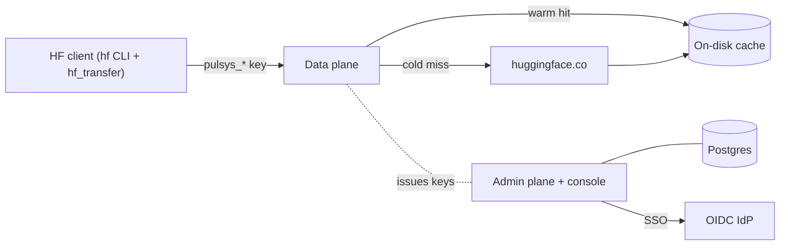

# Architecture

How Pulsys is put together as a system: the components, how a request flows
through them, how it is deployed, and how the on-disk cache is warmed and
bounded. This is the operator's view. For the syscall- and software-level design
(how warm hits use io_uring/sendfile), see [`internals.md`](internals.md); for the
security model, see [`security.md`](security.md).

## Components

A Pulsys deployment is a single trust domain (one team, one tenant) made of four
parts:

| Component | Role |
|-----------|------|
| **Data plane** (`pulsys`) | The HTTP/1.1 proxy. Serves the Hugging Face wire protocol, fills and serves the on-disk cache, and authenticates every request against a Pulsys API key. |
| **Admin control plane** (`pulsys`, admin listener + console) | Issues and revokes `pulsys_*` API keys, runs SSO, queues cache imports, and exposes cache/usage stats. |
| **Postgres** | System of record for the admin plane: API keys, tenants/users, OIDC config, audit log, and the River import queue. Mandatory - Pulsys refuses to start without `PULSYS_DB_DSN`. |
| **OIDC IdP** | External identity provider (Keycloak, Cognito, IAM Identity Center) for admin-console sign-in. Setup: [`oidc.md`](oidc.md). |

Pulsys authenticates to Hugging Face with its **own** read-only token
(`PULSYS_HF_TOKEN`) and never forwards a caller's credential upstream. The
credential model is detailed in [`security.md`](security.md).

## Request flow



- **Cold miss:** the first request for an object streams from `huggingface.co`
  (authenticated with `PULSYS_HF_TOKEN`), is teed to disk, and is returned to the
  client in the same pass.
- **Warm hit:** every later request for the same object is served from disk with
  zero upstream egress, using the platform-specific io_uring/sendfile path.
- **Auth gate:** every data-plane request must carry a valid `pulsys_*` key or it
  is rejected. There is no open mode.

## Deployment topology

Pulsys runs as a **single node**: one `pulsys` process with a local cache
volume plus Postgres. The cache the worker warms is the whole cache. This is
the shape the Helm chart and `docker compose` bring up. Running multiple proxy
replicas is not supported; horizontal scale-out is a roadmap item
([`ROADMAP.md`](../ROADMAP.md)).

Deploy paths:

- Helm chart (JSON-schema-validated, kind-tested in CI):
  [`deploy/charts/pulsys/`](../deploy/charts/pulsys/)
- Production topology and hardening: [`security.md`](security.md)

## Cache warming (import)

`Import from HF` is a cache **pre-warm** workflow, not a hosted registry mirror.
An admin queues a Hugging Face repo and revision from the console; a background
worker downloads it through the proxy path so the on-disk cache is populated
before users request it.

- Jobs are enqueued in Postgres via [River](https://riverqueue.com), which
  provides durable queue semantics, LISTEN/NOTIFY pickup, retries, and job
  metadata without a bespoke lease table.
- The import worker runs inside `pulsys` whenever `PULSYS_DB_DSN` is set. It is
  **on by default**; opt out with `PULSYS_IMPORT_WORKER=0`.
- Downloads warm the cache through an in-process loopback `proxy.Handler` whose
  `PublicBaseURL` is pinned to that listener, so Xet/LFS redirects stay on
  loopback instead of the public ingress URL. This reuses the full proxy routing,
  rewrite, Xet/LFS redirect, and attribution path **without** traversing the
  public data plane or minting Pulsys keys for internal traffic.
- Imports use the same Rust-accelerated `hf` download semantics Pulsys benchmarks
  against; `PULSYS_IMPORT_MAX_WORKERS` controls parallel range fetches and
  `PULSYS_IMPORT_JOB_TIMEOUT` caps a single job (default `24h`).
- When the job revision is symbolic (`main`), import also prefetches
  `/api/.../tree/<commit-sha>` so a later `hf download --revision <sha>` hits
  cached metadata under the default offline policy.

Progress is stored in River job metadata (`phase`, `bytes_done`/`bytes_total`,
`download_bps`, `message`) so the console survives reloads and restarts.

## Cache quota (eviction policy)

Pulsys uses a **hard storage quota plus operator-driven purge** instead of
automatic disk eviction. There is no background LRU, TTL sweeper, or atime
scanner on disk.

- With `-cache-max-bytes` unset or zero, fills are unbounded (legacy behaviour).
- With it positive, the cache enforces a hard deployment-wide quota: new fills
  return `507 Insufficient Storage` once committed bytes plus in-flight
  reservations would exceed the limit.
- Operators reclaim space explicitly by purging models from the console. The
  proxy never deletes files behind an operator's back; shared Xet/LFS bodies are
  reference-counted and freed only when the last owner is purged.

`cache.Store` tracks `usedBytes` (committed `Meta.Total`), `reservedBytes`
(in-flight writes), and `entryCount`, warmed at startup by walking
`cacheDir/v1/objects/*/meta.json`. The console reads `GET
/admin/api/v1/cache/stats` to show usage as `used / quota`:

```json
{ "used_bytes": 988097824, "quota_bytes": 10737418240, "free_disk_bytes": 50000000000, "entry_count": 2 }
```

An in-memory LRU (`internal/cache/lru.go`) is still used for hot-path helpers
(`metaCache` for parsed `meta.json`, `bodyHandles` for open body files). These
bound CPU and file descriptors; they are not a disk-eviction policy.

Enabling the quota has no measurable hot-path cost: a benchstat A/B
(`-cache-max-bytes=0` vs enforced) showed no significant change on the warm and
cold proxy benchmarks, and warm reads stayed at `0 upstream_bytes/op`.

Tenant-scoped quotas and a `statfs`-based free-space guard are deferred; the
process-global quota gives operators a predictable safety rail without a
data-model change.
