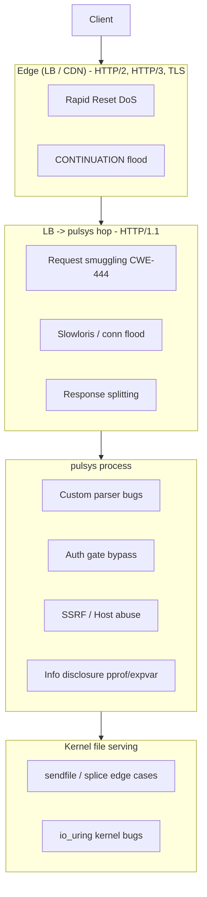

# Security and threat model

This is the security **engineering** doc: the credential model, the review and
test strategy for the custom HTTP/1.1 server, how its parser is compared against
Go's standard library behavior, the deployment topology the guarantees rest on,
the comparable-CVE threat model, and the supply-chain posture. To **report** a vulnerability, see
the disclosure policy in [`SECURITY.md`](../SECURITY.md).

If you only read one section, read [The custom HTTP/1.1 server](#the-custom-http11-server).

## TL;DR for the skeptic

1. **It is authenticated by default, no open mode.** Every data-plane request
   needs a `pulsys_*` API key; Pulsys uses its own read-only Hugging Face token
   upstream and never forwards client credentials. See
   [Credential model](#credential-model).
2. **It is not a general HTTP server.** It is a minimal HTTP/1.1 ingress for one
   hot path (a warm cache-hit `GET`) and falls back to Go's `net/http` for
   everything else. The net-new attack surface is small and enumerable.
3. **The custom parser is tested against Go's standard library behavior.** Every
   byte sequence is fed to both our parser and `net/http.ReadRequest`; if stdlib
   rejects, we reject. Enforced by differential tests, a field-level oracle,
   continuous fuzzing, and public smuggling corpora on every commit.
4. **It runs behind a hardened load balancer by design.** The LB owns the
   public-internet line (TLS, h2/h3, DDoS). See
   [Deployment security model](#deployment-security-model).
5. **We did not copy anyone's test suite.** `net/http` and
   `golang.org/x/net/http/httpguts` are runtime oracles (ordinary imports), not
   vendored test vectors. See
   [Provenance and licensing](#provenance-and-licensing-of-test-material).

---

## Credential model

Pulsys keeps two credentials strictly separate. Both are mandatory; the binary
refuses to start without them.

1. **Client to Pulsys.** Every data-plane request must carry a Pulsys API key
   (`Authorization: Bearer pulsys_...`) minted in the admin UI. Requests without
   one get `401`. This requires `PULSYS_DB_DSN` (the admin plane), which is
   mandatory.
2. **Pulsys to Hugging Face.** Pulsys authenticates to `huggingface.co` with its
   own read-only Hugging Face token, supplied out of band as `PULSYS_HF_TOKEN` (a
   Kubernetes Secret in the Helm chart). This is the only token that ever reaches
   Hugging Face.

The two never cross: a `pulsys_*` key is never sent to Hugging Face, and the HF
token is never handed to a client.

### Cold-miss request handling

When a read misses the cache, the data plane fetches from upstream. Pulsys
**always** drops the caller's inbound `Authorization` before the upstream call,
so a `pulsys_*` key (or any client credential) can never reach Hugging Face. The
credential it sends instead depends on the host:

- **`huggingface.co` and other non content-addressed hosts:** Pulsys sends
  `Bearer <PULSYS_HF_TOKEN>`. This is what makes private and gated cold misses
  work behind the Pulsys key gate.
- **Content-addressed hosts (Xet CAS bridge, LFS CDN):** these authenticate with
  a presigned signature in the query string, so Pulsys sends no `Authorization`
  at all.

The token is read from the environment only, never a CLI flag, so it does not
appear in the process command line or `ps` output.

### Trust boundary

The honest framing is a **shared-cache authorization boundary, one trust domain
per Pulsys instance**:

- A warm hit serves bytes off disk without re-checking entitlement against
  Hugging Face. The cache contains exactly what `PULSYS_HF_TOKEN` can reach.
- Any caller with a valid Pulsys key can read any artifact already in that
  instance's cache. Pulsys does not currently enforce per-key or per-repo access
  control on the data plane.
- The authorization boundary is the Pulsys instance, not Hugging Face. If two
  user populations must not share a model cache, run separate Pulsys instances
  with separate caches and separate tokens.

This fits the common case: a team running a private shared pull-through cache
scoped to repos a single read-only token can access. It is not multi-tenant
isolation. Real per-key/per-repo ACL enforcement on the data plane is tracked as
follow-up work.

### Verifying the behavior

- The inbound `Authorization` is always dropped and replaced with the server
  token in `internal/proxy/handler.go` (`forward`). Pinned by
  `TestForwardInjectsServerHFToken` and `TestForwardNeverForwardsClientToken` in
  `internal/proxy/forward_auth_test.go`.
- Content-addressed stripping is pinned by `internal/proxy/xet_e2e_test.go`.
- Data-plane auth is mandatory: `cmd/pulsys/main.go` refuses to start without
  `PULSYS_DB_DSN`, and the coreserver fails closed when `RequireAuth` is set with
  no gate (`TestCoreServerRequireAuthNilGateDenies`).
- Capture upstream traffic (or point `-default-upstream-host` at a local mock)
  and confirm requests to `huggingface.co` carry the server token and never a
  `pulsys_*` value.

The same token warms the cache during import; see
[`architecture.md`](architecture.md#cache-warming-import).

---

## The custom HTTP/1.1 server

Writing your own HTTP server is, correctly, a red flag. This section explains why
the custom server exists, what it refuses to do, and how its parser is held to
the stdlib bar mechanically, in CI, on every commit.

### Why a custom server at all

The whole value of the warm path is **0 allocations and a single
`sendfile(2)`/`io_uring` splice per cache hit**: file bytes go from disk to socket
without transiting user space (proven in [`internals.md`](internals.md)). Profiling
a `fasthttp`-based ingress showed the remaining per-request allocations and
syscalls originated inside the framework, not our code, and could not be removed
without forking it. The custom server in
[`internal/coreserver/server.go`](../internal/coreserver/server.go) replaces that
ingress with a tiny HTTP/1.1 implementation tailored to the one path that must be
fast.

Two deliberate consequences:

- **HTTP/1.1 only.** HTTP/2 wraps bodies in flow-controlled `DATA` frames, forcing
  a user-space copy and killing the `sendfile` path; HTTP/3 has no `sendfile`
  equivalent and a far larger parser surface. The right pattern is HTTP/2 (or
  HTTP/3) at the edge and HTTP/1.1 on the LB-to-backend hop, which every major LB
  does by default. See [Why HTTP/1.1, not HTTP/2](#why-http11-not-http2).
- **It does the minimum.** No HTTP/2, no chunked request bodies, no trailers.
  Everything else falls through to `net/http` via
  [`bridge.go`](../internal/coreserver/bridge.go).

### Rolling your own parser, and bounding the risk

The danger of a bespoke parser is **request smuggling**: if a front-end and our
backend disagree on where one request ends and the next begins, an attacker can
desync the connection. The mitigations are layered specifically against that.

**Smallest possible surface (reject more than the RFC; fall back for the rest).**
The fast-path parser enforces a stricter-than-RFC subset and closes the connection
on anything ambiguous:

- **Framing:** `Transfer-Encoding` must be `identity`; `chunked`/obfuscated TE,
  TE+CL together, and duplicate/garbage `Content-Length` are refused. The fast
  path never consumes request bodies.
- **Request line:** origin-form only (`/path?query`). Absolute-URI, authority-form
  (`CONNECT`), HTTP/0.9, and any non-1.0/1.1 version are rejected.
- **Tokens/headers:** uppercase methods only; header names validated as `tchar`;
  bare `CR`, `NUL`, and obsolete line folding (`obs-fold`) rejected; exactly one
  `Host` header required (RFC 7230 §5.4); header block capped at 16 KiB.
- **Error taxonomy:** `400` (reusable) for ordinary bad requests, `431` for
  oversized headers, and `400` with mandatory connection close for smuggling
  suspects.

**Differential testing against the Go stdlib (the core defense).**
[`parser_differential_test.go`](../internal/coreserver/parser_differential_test.go)
feeds every input to both our parser and `net/http.ReadRequest` and asserts:
(A) no-looser-than-stdlib (if stdlib rejects, we must); (B) we reject a `mustReject`
list regardless of stdlib (obs-fold, lowercase methods, etc.); (C) field
agreement (method, target, host, content-length, keep-alive must match, or the
warm-hit cache key could derive from a different request than the LB saw).

**Field-level oracle.**
[`parser_validator_oracle_test.go`](../internal/coreserver/parser_validator_oracle_test.go)
checks our validators against `golang.org/x/net/http/httpguts`
(`ValidHeaderFieldName`, `ValidHeaderFieldValue`, `IsTokenRune`), the same
validators `net/http` uses internally, across thousands of randomized inputs.

**Continuous fuzzing.**
[`fuzz_parser_test.go`](../internal/coreserver/fuzz_parser_test.go)
(`FuzzReadRequest`) throws arbitrary bytes at both parsers and asserts neither
panics and the no-looser invariant holds. Crashing inputs are committed as seeds
under `internal/coreserver/testdata/fuzz/`.

**Public request-smuggling corpora.**
[`testdata/portswigger_smuggling.txt`](../internal/coreserver/testdata/portswigger_smuggling.txt)
is a corpus of PortSwigger/James Kettle desync payloads (CL.TE, TE.CL, CL.CL, TE
obfuscation, header injection, obs-fold, Host smuggling, request-line tricks),
each with a `source:` citation, exercised by
[`parser_smuggling_corpus_test.go`](../internal/coreserver/parser_smuggling_corpus_test.go).
The Node.js `llhttp` request fixtures run through the same oracle as a submodule.

**The Linux io_uring parser twin is kept lock-step.** The reactor parser
([`iouring_parser_linux.go`](../internal/coreserver/iouring_parser_linux.go)) must
behave identically to `readRequest`; the same corpus is replayed against it plus
an explicit divergence test.

**Integrated, raw-TCP CVE regression pins.**
[`internal/security/sectest/`](../internal/security/sectest/) drives a live server
over a raw TCP socket to confirm end-to-end behavior (connection close, no second
response on a poisoned connection, counters advance).

### CVE remediation

Each row maps a known vulnerability class (with a representative CVE from a
comparable implementation) to how Pulsys addresses it and the test that pins it.
The full catalog and exploit-chain analysis is in
[Threat model](#threat-model-comparable-cves).

| Class (representative CVE) | Comparable impl. | How Pulsys addresses it | Test anchor |
|---|---|---|---|
| Bare-LF in chunked size (CVE-2025-22871) | Go `net/http` | Non-identity TE refused; bare `LF` accepted only as final header terminator, never inside framing | `cve_regression_test.go` |
| `HEAD`/`GET` with body smuggling (CVE-2024-33452) | OpenResty | Fast path never consumes bodies; methods with bodies fall back to `net/http`; no second 2xx on same connection | `cve_regression_test.go` |
| Allocator amplification on commit (CVE-2025-58185) | Go `net/http` | `http.MaxBytesReader` cap on commit NDJSON bodies | `commit_body_cap_test.go` |
| Request smuggling (CL.TE/TE.CL/CL.CL/TE.TE) | nginx, fasthttp | Stricter-than-RFC framing + no-looser differential + smuggling corpus; suspects force close | `parser_smuggling_corpus_test.go` |
| Response splitting / header injection (CWE-113) | many | Bare `CR`/`LF`/`NUL` rejected in header values; request values cannot echo into response headers | `response_splitting_test.go` |
| Slowloris / connection exhaustion (CWE-400) | many | `IdleTimeout`, `ReadHeaderTimeout`, per-IP connection cap; warm traffic keeps flowing | `slowloris_test.go` |
| SSRF via `Host`/`X-Forwarded-Host` | many | Client host headers ignored for upstream resolution and cache keying; path-prefix proxy allowlisted | `ssrf_test.go` |
| Path traversal | many | `../`, percent/double-encoded traversal, backslash, overlong UTF-8, `NUL` refused | `path_traversal_test.go` |
| Error/info disclosure | many | No stack traces, source paths, or driver markers in bodies | `error_disclosure_test.go` |

The reject-list and corpus were built by reading the CVE history of comparable
parsers (Go core `net/http`, OpenResty/nginx, `fasthttp`, Node.js `llhttp`) and
pinning a regression for each applicable technique. When a referenced parser
hardened a behavior (e.g. Go's bare-LF chunk fix), we added a fixture asserting we
are at least as strict.

### Provenance and licensing of test material

The parser and its test cases are original work; external material is either
imported (not copied) or a properly attributed submodule.

| Material | How it is used | License & attribution |
|---|---|---|
| Pulsys parser + differential case table | Original first-party code | Apache-2.0 (SPDX headers) |
| Go `net/http` (`ReadRequest`) | Runtime oracle in differential + fuzz tests (ordinary `import`) | Go standard library; imported, not redistributed |
| `golang.org/x/net/http/httpguts` | Runtime field-level oracle (ordinary `import`) | BSD-3-Clause; listed in [`THIRD-PARTY-LICENSES.md`](../THIRD-PARTY-LICENSES.md) |
| `nodejs/llhttp` request fixtures | Test fixtures run through our oracle | MIT; git submodule at `internal/coreserver/vendor/llhttp/` retaining its `LICENSE`. The llhttp C parser is a test oracle only, not compiled into or linked by the Pulsys binary |
| PortSwigger / James Kettle research | Short attack payloads in the corpus | Each fixture carries a `source:` citation; no fixture lifted verbatim from proprietary material |

**Did you copy the Go test suite?** No. We do not vendor or adapt `net/http`'s
`*_test.go` vectors. We `import` `net/http` and `httpguts` and run our inputs
through them as living oracles.

### Reproduce the parser-safety tests

```bash
go test ./internal/coreserver/ -run 'Parser|Smuggling|Oracle' -v
go test ./internal/coreserver/ -run '^$' -fuzz FuzzReadRequest -fuzztime 60s
go test ./internal/security/sectest/ -v
go test ./internal/coreserver/ -run IoUring -v          # Linux host, kernel >= 6.1
git submodule update --init internal/coreserver/vendor/llhttp
go test ./internal/coreserver/ -run Llhttp -v
```

---

## CSRF protection

Pulsys admin uses **double-submit cookie** CSRF for all human session mutations.
Machine keys (`Authorization: Bearer pulsys_*`) are exempt.

1. On `POST /auth/session` the backend sets `pulsys_session` (HttpOnly session
   cookie) and `pulsys_csrf` (readable, `SameSite=Strict`, not HttpOnly); the
   response JSON includes `csrf_token` (same value).
2. Mutating requests must send header `X-Pulsys-CSRF` matching both the
   `pulsys_csrf` cookie and the server-side `sessions.csrf_token` row.
3. `GET /auth/csrf` re-syncs the cookie for existing sessions (page reload).

All `POST`/`PUT`/`PATCH`/`DELETE` are protected except `POST /auth/session`
(login, no prior token). PAT bearer auth skips CSRF validation. The admin SPA
(`admin-ui/src/lib/csrf.ts`) reads the cookie and attaches the header via
`api.ts`; `syncCSRF()` runs on console boot.

---

## Deployment security model

This section is **normative** for operators. The deployment topology Pulsys was
designed for is the assumption its security posture rests on; deviating voids the
guarantees the code makes about itself.

### TL;DR

1. Pulsys MUST run behind a TLS-terminating reverse proxy that handles HTTP/2 /
   HTTP/3 at the edge and forwards HTTP/1.1 to the backend (AWS ALB, GCP HTTPS LB,
   Cloudflare, nginx ≥ 1.21, Envoy ≥ 1.30 all do this by default).
2. The frontend-to-backend hop MUST be HTTP/1.1. Do not enable
   `proxy_http_version 2.0` (or equivalent) toward Pulsys.
3. The admin listener (`-admin-listen`, default `127.0.0.1:6060`) MUST be bound to
   loopback or an internal-VPC address; never `0.0.0.0` or a public IP.
4. The pprof listener (`-pprof-listen`) is opt-in and disabled by default; it MUST
   stay on loopback (it leaks heap, goroutines, environment, command line).
5. Don't expose `-listen` directly to the public internet without a hardened
   front-end.

### Why HTTP/1.1, not HTTP/2

The warm path uses `sendfile(2)` + `sf_hdtr` (Darwin) and io_uring SPLICE (Linux
≥ 6.1) to copy file bytes disk-to-socket without transiting user space (see
[`internals.md`](internals.md)). HTTP/2 wraps bodies in `DATA` frames with their
own flow-control accounting, forcing at least one full user-space copy per
response so `WINDOW_UPDATE` counters update correctly; the sendfile fast path
stops working. HTTP/3/QUIC is worse: no sendfile equivalent, a larger parser
surface (datagram/packet/frame/stream), and several CVEs in major
implementations. The right defense-in-depth pattern is HTTP/2 (or HTTP/3) at the
edge, HTTP/1.1 on the LB-to-backend hop.

### Required topology

```
+--------+      +----------------------+      +-----------+      +-----------+
| Client | <==> | Reverse Proxy / LB   | <==> |  pulsys   | <==> | HF origin |
| (h2/h3)|      | (CF / ALB / nginx /  |      | (HTTP/1.1)|      |  (https)  |
|        |      |  Envoy)              |      |           |      |           |
+--------+      +----------------------+      +-----------+      +-----------+
                  Frontend enforces:            Backend enforces:
                   - HTTP/2 / HTTP/3 framing     - HTTP/1.1 framing (parser)
                   - TLS termination             - PAT / OIDC auth (auth gate)
                   - Strict header validation    - Origin allowlist
                   - HTTP/1.1 downgrade           - Disk cache
```

The reverse proxy plays four roles: TLS termination, HTTP/2/3 → HTTP/1.1
bridging, DDoS/connection-flood defense, and a defense-in-depth second parser.
(A single-parser deployment with no LB is actually safer against smuggling
specifically, but is not viable for the other three reasons.)

### LB configuration checklist

**AWS Application Load Balancer**

- Attributes → **Drop Invalid Header Fields**: ON (rejects NUL, bare CR/LF,
  non-ASCII before they reach Pulsys).
- Attributes → **HTTP/2**: ON (client side; ALB downgrades to HTTP/1.1 to targets).
- Listener default action forwards HTTP/1.1 to the target group.
- Health check on `/healthz` against `-admin-listen` (VPC-bound, not loopback,
  not internet-reachable).

**nginx**

```
http {
    underscores_in_headers   off;
    ignore_invalid_headers   on;
    client_max_body_size     50G;          # adjust to your model upload size
    upstream pulsys { server 127.0.0.1:8080; }
    server {
        listen 443 ssl http2;              # client side: http2
        location / {
            proxy_pass         http://pulsys;
            proxy_http_version 1.1;        # do NOT set 2.0 toward the backend
            proxy_set_header   Host              $host;
            proxy_set_header   X-Forwarded-For   $proxy_add_x_forwarded_for;
            proxy_set_header   X-Forwarded-Proto $scheme;
            proxy_read_timeout 300s;
        }
    }
}
```

**Envoy**

```yaml
# listener: http_protocol_options { accept_http_10: false, allow_chunked_length: false }
#           http2_protocol_options: {}        # accept h2 from client
# cluster:  explicit_http_config.http_protocol_options: {}   # backend hop: http1.1
```

**Cloudflare**: no tunables required; it validates h2/h3 framing client-side and
downgrades to HTTP/1.1 to origin. Ensure **"HTTP/2 to Origin"** (SSL/TLS → Edge
Certificates) is OFF (the default).

### Admin and pprof listeners

`-admin-listen` (default `127.0.0.1:6060`) hosts `/auth/*`, `/admin/api/v1/**`,
`/healthz`, `/metrics`. It is the auth plane; the CSRF and session-cookie posture
assume it is reachable only from inside the trusted network. For a public admin
UI, terminate it on the same hardened reverse proxy with WAF rules on `/auth/`
and `/admin/`.

`-pprof-listen` is empty by default (pprof/expvar not exposed). Enabling it leaks
the process command line, heap, every goroutine stack, and (expvar) the process
environment. Treat it as a production secret: loopback only, access via SSH
tunnel. The binary logs a warning if the bind address is not loopback, but the
warning is advisory.

### In-process slowloris controls

The reverse proxy is the primary defense; Pulsys adds belt-and-suspenders knobs
for a misconfigured LB or an internal-network attacker. All default to safe
values.

| Flag | Default | Phase | Effect |
|------|---------|-------|--------|
| `-idle-timeout=DUR` | 60s | Idle | Close a connection with no byte arriving (just accepted or keep-alive idle). |
| `-read-header-timeout=DUR` | 5s | Header | Request line + headers must fully parse within this window. Bounds the dribble slowloris. |
| `-max-conns-per-ip=N` | 0 (off) | Accept | When >0, the accept loop refuses new connections from a peer IP already holding N (closed without a response). |
| `-read-timeout=DUR` | 300s | Body | Per-request body budget; generous so multi-GiB LFS uploads complete. |

`pulsys_proxy_per_ip_cap_dropped` (expvar) increments per connection refused under
`MaxConnsPerIP`. The contract is pinned by `sectest/slowloris_test.go`. The
io_uring reactor enforces the same deadlines and the per-IP accept cap (peer
resolved via `Getpeername` after the ACCEPT CQE), pinned by
`sectest/iouring_per_ip_cap_linux_test.go`.

### Allocator-amplification caps

- **Registry commit:** `POST /api/{type}/{repo}/commit/{rev}` parses an NDJSON
  body that may carry inline file contents. Pulsys wraps it in
  `http.MaxBytesReader` (`-commit-max-bytes`, default 64 MiB); over the cap
  surfaces `413` (the reader-side `*http.MaxBytesError` is preferred over any
  downstream JSON syntax error so a 413 is never misclassified as 400). Pinned by
  `businesslogic/commit_body_cap_test.go`.
- **LFS PUT:** `-lfs-max-bytes` (default 200 GiB) short-circuits oversize
  `Content-Length` with `413` and wraps the body in `lfsLimitReader` so a
  chunked/lying-CL client trips a 413 mid-flight instead of writing a truncated
  blob.

### Parser-error observability

The parser publishes a `pulsys_parser_errors` counter map (expvar) by class:
`bad_request` (connection may be reused), `smuggling_suspect` (connection
closed), `header_too_large` (431). `smuggling_suspect` is the primary monitoring
signal for desync probe campaigns: a sharp rise from a single peer IP is the
textbook fingerprint of Burp Turbo Intruder / `http-desync-scanner` / a raw-TCP
fuzz harness. Alert when the rate exceeds ~1/min/peer; in steady state it is
essentially zero. The taxonomy is identical for the stdlib and io_uring paths.

### Business-logic invariants

Enterprise invariants that survive parser + auth checks but still cause real
damage if violated (regression matrix under `internal/security/businesslogic/`,
BUSL-01..09):

1. **PAT revoke propagates in-process.** `RevokeToken` returns the sha256 hash;
   the handler calls `PATGate.InvalidateByHash` in the same request, closing the
   residual 60s admit window.
2. **Double-revoke is idempotent** (`X-Pulsys-Idempotent-Replay` header; no
   duplicate audit row).
3. **Token scopes whitelisted at mint** (`{models:read, models:write, admin:read,
   admin:write, admin:*}`; else 400).
4. **Token TTL bounded** (0/negative/>366d all 400).
5. **Settings PUT enforces strict CAS** (version=0 create-only, >=1 optimistic;
   409 on mismatch).
6. **Commit pipeline cross-checks LFS sizes** (`ErrLFSSizeMismatch` → 422).
7. **Commit file paths validated** (empty/oversize/leading-`/`/NUL/backslash/CRLF/`..`
   → 400).
8. **LFS PUT body bounded** (see above).

### Verification checklist before going live

- [ ] `curl http://<public-addr>/debug/pprof/` returns 404 (not 200)
- [ ] `curl http://<public-addr>/debug/vars` returns 404
- [ ] `/auth/me` unreachable from the public address (admin port not exposed)
- [ ] `curl -H 'Transfer-Encoding: chunked' -H 'Content-Length: 4' http://<public-addr>/` → 400 + `Connection: close`
- [ ] `curl -H 'Host: x' -H 'Host: y' http://<public-addr>/` → 400 (duplicate Host)
- [ ] LB drops bare CR/LF in header values (`printf "GET / HTTP/1.1\r\nHost: x\r\nX: foo\rbar\r\n\r\n" | nc <addr> 443 -w 1`)
- [ ] `nmap` shows ONLY the public listener port open from the internet

### Linux / io_uring security harness

The OWASP WSTG matrix (`internal/security/sectest`, `authcontract`) was authored
on Darwin. The Linux-only reactor parser and pipeline are covered by a
docker-compose stack (`scripts/security-tests-linux.sh`,
`Dockerfile.security-tests`) that runs three passes: (1) full matrix on Linux
cork+sendfile, (2) io_uring-specific coverage (PortSwigger corpus through
`parseRequestFromBuf`, divergence test, end-to-end `TestWarmHitIoUring`, reactor
shutdown), (3) reactor shutdown under a tight 45s timeout. Kernel requirement
6.1+. The harness closed two reactor goroutine-leak hazards (detached-fallback
slowloris deadline; reactor never observing `Close()`, fixed with an `eventfd`
wake SQE).

---

## Threat model: comparable CVEs

For operators, security reviewers, and red teams evaluating a self-hosted
deployment. It maps public CVE history from architecturally similar systems to
the attack techniques they represent, then states which apply to Pulsys.

Pulsys overlaps with four public design areas: Go `net/http` (same runtime;
stdlib oracle; fallback bridge), `valyala/fasthttp` (prior ingress; custom
HTTP/1.1 parser; same smuggling failure modes), nginx/OpenResty/Envoy (typical
edge LB), and Linux sendfile + io_uring (warm-cache file serving).

### Technique taxonomy



Edge and hop techniques are why Pulsys MUST sit behind a hardened LB. Core
techniques are what the OWASP matrix targets. Kernel techniques affect
availability (and rarely host integrity), not HTTP semantics.

### CVE catalog by technique

**Request smuggling (CWE-444)** — the dominant advanced class. Two parsers
disagree on request boundaries; the attacker smuggles a request past the front
WAF or poisons the next client's response.

| CVE / ID | Product | Technique |
|---|---|---|
| CVE-2025-22871 | Go `net/http` | Bare LF as chunk-size terminator |
| CVE-2022-1705 | Go `net/http` | Invalid Transfer-Encoding combos |
| CVE-2015-5740 | Go `net/http` | Duplicate Content-Length (CL.CL) |
| CVE-2024-33452 | OpenResty | HEAD with body → response queue poisoning |
| fasthttp PR #1899/#1719 | fasthttp | Newline in chunk ext; stricter TE/CL |
| PortSwigger VU#421644 | many | TE.CL, CL.0, H2→H1 downgrade gadgets |

Relevance **HIGH** on the LB→backend hop; mitigated by parser hardening +
differential/fuzz/corpus tests + mandatory LB strict framing. Residual risk: any
new parser refactor or LB misconfiguration (HTTP/2 toward backend, permissive
chunk parsing).

**HTTP/2 / HTTP/3 DoS (edge only)** — Pulsys does not speak HTTP/2. CVE-2023-44487
(Rapid Reset, CISA KEV), VU#421644/CVE-2024-28182 (CONTINUATION flood),
CVE-2024-27919 (Envoy). Relevance **NONE directly**, **CRITICAL indirectly**: the
edge must be patched (nghttp2 ≥ 1.61.0, Rapid Reset mitigations).

**Connection exhaustion / slowloris (CWE-400)** — idle hold, header dribble,
per-IP fan-out. Relevance **MEDIUM** without the slowloris controls, **LOW-MEDIUM**
after. Primary line remains the LB. Tests: `sectest/slowloris_test.go`.

**Memory exhaustion via parser/allocator (CWE-770)** — CVE-2025-58185 (asn1
pre-allocation), CONTINUATION flood, huge single header / obs-fold / unlimited
pipelining. Go is memory-safe but OOM is as good as RCE for availability.
Relevance **MEDIUM** for HTTP/1.1 header size (fixed scratch cap), watch registry
commit JSON + LFS upload (both capped).

**Zero-copy / kernel path** — CVE-2024-26640 (sendfile+TCP zerocopy panic),
CVE-2025-23154 / CVE-2024-58000 / CVE-2024-41080 / CVE-2024-50079 (io_uring).
Relevance **LOW for remote RCE**, **MEDIUM for host availability** on old kernels
with `-iouring`. Mitigation: stable kernel ≥ 6.6, `-iouring` off unless
benchmarked need.

**Auth boundary / cache confusion** — revoked PAT still cached (the 2026-05-21
incident; fixed with in-process invalidation + `authcontract` matrix), smuggling
+ response queue, cache-key split via URI/double-encoding mismatch. Relevance
**HIGH** for PAT/session propagation (fixed), **MEDIUM** for path normalization on
registry routes.

**SSRF / Host header** — Host/X-Forwarded-Host injection, absolute-URI request
line, Location CRLF. Relevance **MEDIUM**; origin allowlist + Host validation are
the control (`sectest/ssrf_test.go`, `response_splitting_test.go`).

**Information disclosure** — `/debug/pprof`, `/debug/vars`, stack traces in 500s,
404 shape oracle. Relevance **HIGH** if pprof or admin bound off-loopback
(`sectest/info_disclosure_test.go`).

### Trust boundaries

```
[Untrusted Internet]
   |  <- TB1: TLS + WAF + h2 limits
[Reverse Proxy / LB]
   |  <- TB2: HTTP/1.1 framing + PAT (data plane)
[pulsys -listen]
   |--> [HF origin]            <- TB3: allowlist + SSRF controls
   |--> [Postgres / blobstore] <- TB4: RLS + tenant ID
[pulsys -admin-listen]         <- separate boundary; loopback/VPC only
```

Any request crossing TB2 without passing the auth gate on protected routes is a
Severity-1 finding.

### Residual risks

| Priority | Risk | Why it persists |
|---|---|---|
| P0 | LB misconfiguration (h2 to backend, permissive chunks) | Outside binary; operator error |
| P0 | Direct `-listen` to internet | Bypasses the edge control stack |
| P1 | New parser regression | Hand-rolled parser is a high-value target |
| P1 | io_uring accept path edge cases | Documented; `-iouring` default off |
| P2 | Business-logic IDOR in new registry endpoints | Needs per-endpoint authcontract rows |
| P2 | Kernel CVE on sendfile/io_uring path | Distro-kernel dependency |
| P3 | Go stdlib CVE in fallback path | `govulncheck` + toolchain pin |

### Red-team / pentest checklist

**Edge:** confirm Rapid Reset + CONTINUATION mitigations on the LB; confirm the
backend hop is HTTP/1.1 only; attempt TE.CL/CL.CL/bare-LF/HEAD+body through the
LB→Pulsys path. **Data plane:** raw-TCP smuggling corpus (expect 400 + close);
slowloris (idle, dribble, per-IP cap); revoked/expired/wrong-scope PAT on every
route; LFS upload at cap+1; path traversal / double-encoding; SSRF via Host;
bogus methods (no 5xx). **Admin plane:** `-admin-listen` not internet-reachable;
OIDC session fixation / CSRF; settings CAS race; scope allowlist. **Disclosure:**
`/debug/pprof` and `/debug/vars` unreachable off-box; 500s contain no stack
traces. **Availability:** warm-path throughput under attack; goroutine count
stable after a connection flood.

### Monitoring signals

| Signal | Indicates |
|---|---|
| `pulsys_proxy_per_ip_cap_dropped` ↑ | Connection flood reaching backend directly |
| Parse-error rate ↑ + single source IP | Smuggling probe or broken client |
| `pulsys_offline_refusals` ↑ | Cache miss under attack or key mismatch |
| LB 502/504 while Pulsys healthy | Edge exhaustion (h2 DoS class) |
| PAT auth 401 → 200 flip without redeploy | Possible cache invalidation bug |

### References

Request smuggling: [PortSwigger HTTP desync](https://portswigger.net/research/http-desync-attacks-request-smuggling-reborn),
[CVE-2025-22871 / Go #71988](https://github.com/golang/go/issues/71988),
[CVE-2024-33452 OpenResty HEAD](https://www.benasin.space/2025/03/18/OpenResty-lua-nginx-module-v0-10-26-HTTP-Request-Smuggling-in-HEAD-requests/).
HTTP/2 DoS: [CVE-2023-44487 (CISA)](https://www.cisa.gov/news-events/alerts/2023/10/10/http2-rapid-reset-vulnerability-cve-2023-44487),
[VU#421644 (CERT/CC)](https://www.kb.cert.org/vuls/id/421644).
fasthttp: [PR #1719](https://github.com/valyala/fasthttp/pull/1719),
[PR #1899](https://github.com/valyala/fasthttp/pull/1899).
Kernel: [CVE-2024-26640](https://nvd.nist.gov/vuln/detail/CVE-2024-26640).

---

## Supply-chain posture

Pulsys ships as a single-tenant binary deployed in the customer's VPC, so the
threat model is mostly supply-chain: customers trust the binary, the docs, and
the deploy pipeline.

| Surface | Scanner | Cadence | Action on finding |
|---|---|---|---|
| Go module + stdlib reachability | `govulncheck` | every push, nightly | fail CI on any reachable vuln |
| npm workspaces (`./`, `website/`, `admin-ui/`, `infra/cdk/`) | `npm audit` | every push, weekly | fail CI on high+; log moderate+ |
| Repo filesystem | `trivy fs` | every push, weekly | fail CI on HIGH/CRITICAL with fix |
| SBOM | `syft` → SPDX | every push to `main` | publish artifact for 90 days |
| Dependencies (Go/npm/docker/actions) | Dependabot | weekly | open PR; humans review |

The matrix lives in `.github/workflows/security.yml` and `.github/dependabot.yml`.

**Toolchain pinning.** `go.mod` carries an explicit `toolchain go1.25.10` so local
builds use a known-patched compiler regardless of the developer's installed Go.
CI resolves `go-version: '1.25'` to the latest 1.25.x so security patches land
automatically. When `govulncheck` was first wired up, the stdlib at `go 1.25.0`
had 21 reachable CVEs; a toolchain bump to `go 1.25.10` plus `jackc/pgx` v5.5.4 →
v5.9.2 brought `govulncheck ./...` to "No vulnerabilities found."

**Image scanning.** Trivy fs scanning catches CVEs in our Dockerfiles + npm trees.
The Compose stack pins `postgres:16-alpine` and
`quay.io/keycloak/keycloak:26.0.5`. Final-image surface scanning is a future
addition once versioned images ship to a registry.

**Compromised-package monitoring.** Lockfiles in all four npm workspaces mean a
compromised upstream version cannot land via `npm install` without the lockfile
visibly changing; Dependabot opens the PR and `npm audit --audit-level=high`
re-runs against the proposed lock. The human in PR review is the blocker until
`npm audit signatures` matures.

---

## Honest limitations

- **A single deployment cannot enumerate every front-end.** Differential tests
  against Go's standard library reduce smuggling risk, but the only way to be
  sure your specific LB agrees on framing is to run it that way. Follow the LB
  checklist above.
- **The fast path is bespoke; the slow path is `net/http`.** New parser bugs, if
  any, live in the small warm-`GET` surface, not in upload/commit/admin flows.
- **The admin plane is loopback-only by design** and was not built for direct
  internet exposure.
- **Not multi-tenant.** The data plane has no per-key/per-repo ACL yet; isolate
  trust domains at the instance boundary.

To report a vulnerability, follow [`SECURITY.md`](../SECURITY.md) (GitHub Private
Vulnerability Reporting). Key management for admin auth (OIDC client secrets, PAT
signing) is covered in [`oidc.md`](oidc.md) and the `PULSYS_*` env vars in
[`cmd/pulsys/main.go`](../cmd/pulsys/main.go).
